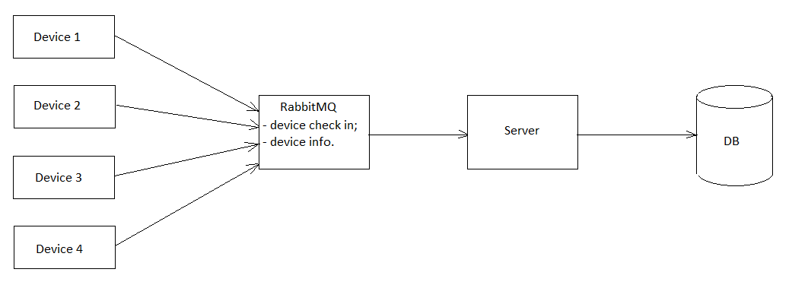

# public-transport-devices-csharp

Read this in other languages: [English](README.md), [Russian/Русский](README.ru.md).

## Technical requirements

1. Develop the architecture of a real-time analytics system.
Input data:
     - Data is collected from 20 thousand devices every second;
     - Type of data collected: operation parameters of sensors and devices, geolocation;
     - The data is used for subsequent display on dashboards.

Propose a service architecture: what components should it consist of?
Why are certain solutions chosen?
What technologies are used and why?

2. Implement a prototype of the analytics system in C#.
The prototype is a server application.
This application is required primarily to collect data from devices installed on vehicles.

The server receives requests from the client and processes them:
- Registration of the device with entering it into the database;
- Registration of a new event for a specific device with its entry into the database;
- Processing the event list request.

An event can be considered a JSON received by a service that contains key-value pairs, where the value is the data types `int`, `float` and `str`.
How communication between devices and the event collection system will be implemented, as well as whether you will implement device authorization, a queue for storing the event stream, or otherwise select events from this device is also your choice.

## Architecture 

An explanation of why this type of architecture was chosen can be found at [this link](docs/architecture.md).
