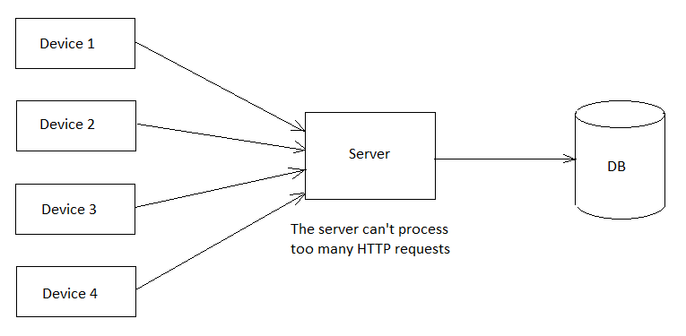

# Архитектура 

Доступно на других языках: [English/Английский](architecture.md), [Russian/Русский](architecture.ru.md).

## Простой клиент-серверный подход

Главный недостаток такого подхода в том, что сервер не мог одновременно обрабатывать слишком много запросов (примерно 10-500 запросов в секунду).
Поскольку нам нужно обрабатывать 20 000 запросов в секунду, нам нужно развернуть от 40 до 2 000 экземпляров приложения.

## Использование очереди сообщений 

