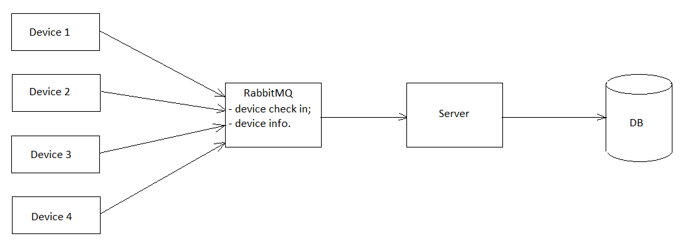

# Архитектура 

Доступно на других языках: [English/Английский](architecture.md), [Russian/Русский](architecture.ru.md).

## Простой клиент-серверный подход


Главный недостаток такого подхода в том, что сервер не мог одновременно обрабатывать слишком много запросов (примерно 10-500 запросов в секунду).
Поскольку нам нужно обрабатывать 20 000 запросов в секунду, нам нужно развернуть от 40 до 2 000 экземпляров приложения.

## Использование очереди сообщений 



## Оптимизация запроса для добавления данных в БД 

В настоящей реализации используется обычный insert, время продолжительности которого примерно 135-145 мс. 

```C#
                var uid = device.Uid; 
                var latitude = device.GeoCoordinate.Latitude; 
                var longitude = device.GeoCoordinate.Longitude; 
                var dtCreated = device.DateTimeCreated.ToString(); 
                var specificData = System.Text.Json.JsonSerializer.Serialize(device.SpecificData); 
                string sql = @$"
insert into public.pt_device_info (device_uid, latitude, longitude, datetime_created, specific_data)
values('{uid}', {latitude}, {longitude}, '{dtCreated}', '{specificData}')"; 
                _dbConnection.ExecuteSqlCommand(sql); 
```

Также есть альтернативный способ - использование функции следующего вида. Её основной плюс заключается в достаточно большой гибкости в плане функционала, однако она выполняется 195-200 мс, что довольно медленно по сравнению с обычным insert'ом (таким образом, один insert будет выполняться примерно на 50 мс быстрее данной функции, а 100 insert'ов - уже на 5 секунд быстрее): 

```SQL
create or replace function insert_into_pt_device_info(
    a_device_uid text,
    a_latitude double precision, 
    a_longitude double precision, 
    a_datetime_created varchar(100), 
    a_specific_data text)
returns void as 
$$
declare
   l_pt_device_id integer;
begin
    select d.pt_device_id
    into l_pt_device_id
    from public.pt_device d
    where d.device_uid = a_device_uid; 

    if l_pt_device_id = null then 
        return; 
    end if; 

    insert into public.pt_device_info (pt_device_id, latitude, longitude, datetime_created, specific_data)
    values (l_pt_device_id, a_latitude, a_longitude, a_datetime_created, a_specific_data); 
end
$$ language plpgsql;
```

Для такой функции нужно немного изменить определение таблицы `public.pt_device_info`: 

```SQL
create table if not exists public.pt_device_info
(
    pt_device_info_id serial primary key, 
    pt_device_id integer references public.pt_device (pt_device_id), 
    latitude float8,
    longitude float8, 
    datetime_created varchar(100),
    specific_data text
);
```
